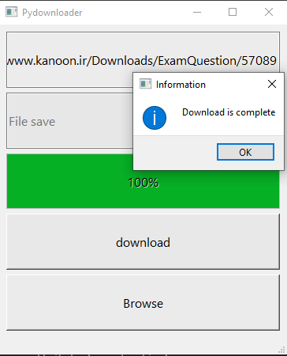
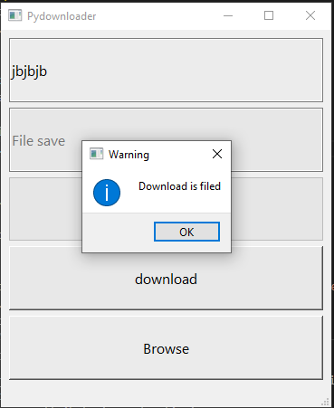

# Pydownloader


## python


This project is written in Python version 3.10.8

I have used the [pyside6](https://pypi.org/project/PySide/) library for this project.





If you enter the wrong address in this field This message will be displayed for you



### **Usage**
---

First install pyside6 library
 ```
pip install pyside6
 ```
second write in the Terminall:
 ```
 pyside6-designer
 ```
 If the above is done successfully you can run the progaram.
  ```
downloader.py
   ```

   
